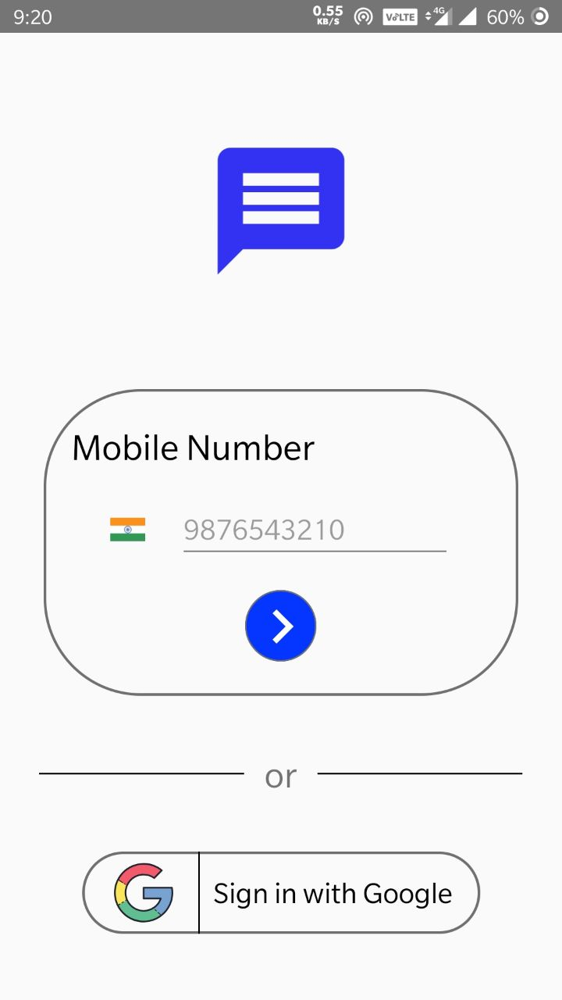
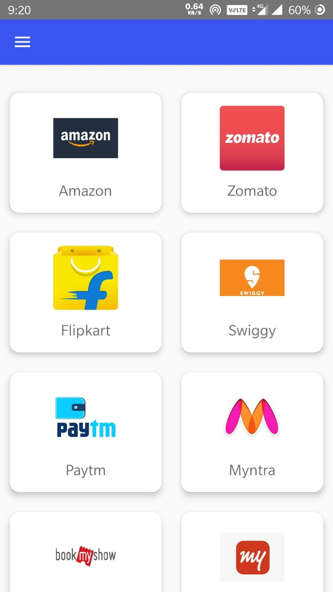

# Alohomora

[![Contributors][contributors-shield]][contributors-url]
[![MIT License][license-shield]][license-url]

<!-- TABLE OF CONTENTS -->
## Table of Contents

* [About the Project](#about-the-project)
  * [Built With](#built-with)
  * [Wireframe](#wireframe)
  * [Project Management](#project-management)
* [Getting Started](#getting-started)
  * [Prerequisites](#prerequisites)
  * [Installation](#installation)
* [Contributing](#contributing)
* [License](#license)
* [Contact](#contact)

<!-- ABOUT THE PROJECT -->
## About The Project

&nbsp;&nbsp;&nbsp;&nbsp;&nbsp;&nbsp;&nbsp;&nbsp;&nbsp;&nbsp;&nbsp;&nbsp;&nbsp;&nbsp;&nbsp;&nbsp;&nbsp;&nbsp;&nbsp;&nbsp;&nbsp;&nbsp;&nbsp;&nbsp;

An android application which displays coupon codes and offers of popular brands

Here's why:
* To provide all the coupons in the single place :smile:
* To know whether the coupon is currently active or not

### Built With
We mainly built this application with java and android.Android Studio IDE has been used to develop this application.Database is powered by Google's Firebase Realtime Database
* [Java](https://www.java.com/en/)
* [Android](https://developer.android.com/)
* [Firebase](https://firebase.google.com/)
* [Android Studio](https://developer.android.com/studio)
* [Adobe XD](https://www.adobe.com/in/products/xd.html)
* [Trello](https://trello.com/en)

### Wireframe
Wireframe for this project has been done with the help of Abobe XD Wireframe

[WireFrame UI](https://xd.adobe.com/view/cd121bf8-c69c-448c-7b4d-83ce4e44b24c-bb23/) - Feel free to open,no authentication is required

### Project Management
Project has been managed with the help of Trello

[Project Management Cards](https://trello.com/c/cwWKJJIO/1-ui-design) - Feel free to open,no authentication is required

<!-- GETTING STARTED -->
## Getting Started

### Prerequisites

Just a basic knowledge on how to install and use an andorid app

### Installation

1. Download the apk file from the repo
2. Enable unknown source installation on your device
3. Open the apk file to install it
4. Bingo! Now you got what you want

<!-- CONTRIBUTING -->
## Contributing

Contributions are what make the open source community such an amazing place to be learn, inspire, and create. Any contributions you make are **greatly appreciated**.

1. Fork the Project
2. Create your Feature Branch (`git checkout -b feature/AmazingFeature`)
3. Commit your Changes (`git commit -m 'Add some AmazingFeature'`)
4. Push to the Branch (`git push origin feature/AmazingFeature`)
5. Open a Pull Request

<!-- LICENSE -->
## License

Distributed under the MIT License. See `LICENSE` for more information.

<!-- CONTACT -->
## Contact

[SriniVasan](https://github.com/srinivasan-devaraj) - srinivasan16.devaraj@gmail.com

[Santhosh](https://github.com/santhosh2514) - santhosh.25na@gmail.com

<!-- MARKDOWN LINKS & IMAGES -->
<!-- https://www.markdownguide.org/basic-syntax/#reference-style-links -->
[contributors-shield]: https://img.shields.io/github/contributors/othneildrew/Best-README-Template.svg?style=flat-square
[contributors-url]: https://github.com/mudivizhi/Alohomora/graphs/contributors
[issues-url]: https://github.com/othneildrew/Best-README-Template/issues
[license-shield]: https://img.shields.io/github/license/othneildrew/Best-README-Template.svg?style=flat-square
[license-url]: https://github.com/othneildrew/Best-README-Template/blob/master/LICENSE.txt
[linkedin-shield]: https://img.shields.io/badge/-LinkedIn-black.svg?style=flat-square&logo=linkedin&colorB=555
[product-screenshot]: images/1.jpg
